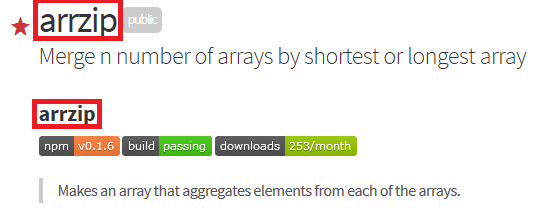

##npmprep

[](https://www.npmjs.com/package/npmprep)
[](https://travis-ci.org/abrelsfo/npmprep)
[](http://npmjs.org/npmprep)

> npm adds your title and description to the top of the page and then adds everything in your README. This will strip the title from the README, publish to npm, and then add the title back to the README. That way it is still good to publish on github as well. You need to run ```npm adduser``` before running this though.


<br>

## Install

```
$ npm install --save npmprep
```


## Usage

```js
const npmprep = require('npmprep');

npmprep();
//=> Removes the title, tries to publish to npm, adds title back to README
```

<br>

## API

### npmprep

tries to publish from the current directory.<br>
Remove the name of the module from the README, publish to npm, add name back

<br>

## CLI

```
$ npm install --global npmprep
```

```
$ npmprep --help

  Usage
    npmprep

  Examples
    $ npmprep
    Remove the name of the module from the README, publish to npm, add name back
```


## License

MIT © [Alex Brelsford](abrelsfo.github.io)
